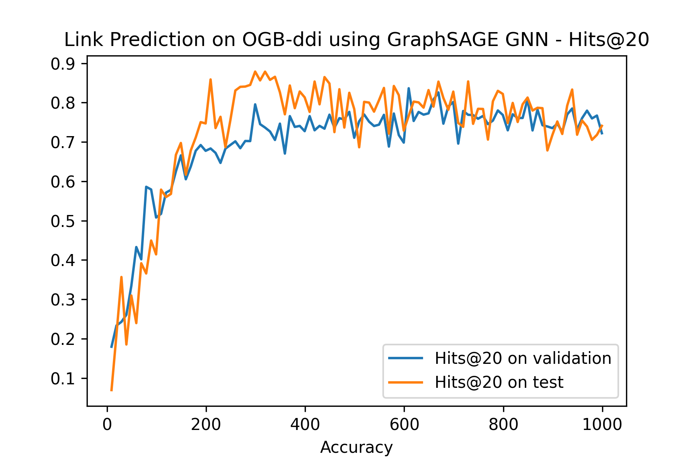

# link-prediction-graphsage

The project uses pairwise learning for neural link prediction(PLNLP) framework for predicting drug-drug interactions(DDI) on OGB-ddi dataset.

## Key points
1. Encoder : Graph Neural Netwrom with graphSAGE layers.

2. Link prediction : Multi layer perceptron with single output

3. Loss function : Instead of minimizing cross entropy loss the framework minimizes auc loss.

## Loss Curve

## Metric Curve

